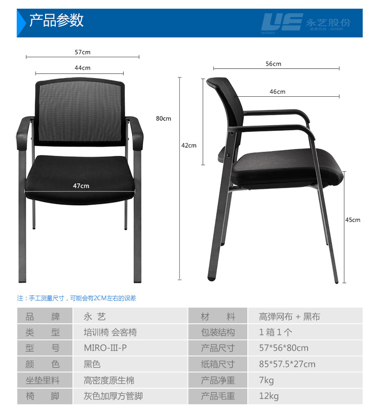

人体工学座椅这个概念在这几年迅速风靡起来，如果没用过这个椅子都感觉有点不好意思跟别人说自己跟电脑打交道的。尤其是互联大厂纷纷以其为“福利”吸引各种打工人，从国外的FLAG到国内的BAT，人体工学椅似乎被打了一个“高端”的标签。而椅子的品牌则从高端的Herman Miller、冈村到国内的保友、Ergomax。甚至出现了很多ODM的产品，严选、京东。人体工学座椅的产品完成了从高、中、低的全层面覆盖。但问题是，我们真的需要一张人体工学椅吗？

诚然，一张椅子对一个长期伏案或者电脑工作者是非常重要的。但是我们真的需要一张1万块左右的Aeron2？Embody和严选的又有什么不一样呢？要解答这个问题，首先要考虑我们到底想要的是什么？是健康的颈、腰、臀。那怎样才能得到健康的颈腰臀呢？答案是科学的座姿+适当的辅助。关于科学坐姿的解释，可以参考知乎[这个答案][1]，我这里贴个图：

从上面的图可以看出来，其实坐姿是一个比较系统的内容。如果你能按照这些参数，从脚底开始测量，量好坐高、桌子高度、显示器高度，就算是完全固定的椅子和桌子也能得到一个合理的坐姿，再加上自身的肌肉锻炼，就完全可以了，根本不用所谓的人体工学座椅。张大妈[这篇][2]文章就非常好的说明问题。

如果你是新选购桌子+椅子，完全可以参考上述文章。

对于桌子，首先定制一个略低于常规的桌子。75CM的桌面真的太高了，我现在就是76CM的桌面高度，手需要抬得比较高才能使用鼠标，导致使用鼠标时的支撑点在手掌，手非常累。对于180的男生，68CM左右是比较合适的台面高度（记住是包括台面板材厚度）

我用的是永艺的这张椅子：

目前的椅子高度其实是合适的，不过这张椅子除了太窄（因为太胖了T_T），在我坐满后，基本无法打开大腿。对男生来说有点难受，懂得都懂。所以椅子除了高度外，宽度也是一个比较重要考量的因素。

所以回到刚才的问题，我们到底需要一个1万多的人体工学座椅吗？我认为是不需要的，除非：

<ol class="wp-block-list">
  <li>
    你无法决定桌子或者椅子的高度，来适应自身的坐姿。例如你在公司、桌子的高度固定，这时你可以考虑用人体工学椅子去适应桌子的高度。但是需要注意这个调整只能在一个比较小的范围，并且你能得到只是一个次优解。
  </li>
  <li>
    长时间*不能离开座位*的，我相信除了除了一些特殊岗位外，并不存在这种情况。所有的人体工学座椅所谓的支撑，还不如你每一个小时走动1-2分钟。而且有一些所谓的支撑，反而是反人类的错误设计。例如友保的金豪E+，我在公司就有用，顶得我的腰难受。
  </li>
  <li>
    需要底部透气的，目前人体工学椅大部分都是网布设计的。但是要注意，用网布带来一个问题就是如果网布的弹力太弱，可能会导致凹陷，压迫大腿。尽可能用好面料的座椅，就我目前的体验，网布确实会带来一定的不正确大腿受力。
  </li>
</ol>

 [1]: https://www.zhihu.com/question/23238816/answer/151365820
 [2]: https://post.smzdm.com/p/a25r9xzp/p2/#comments